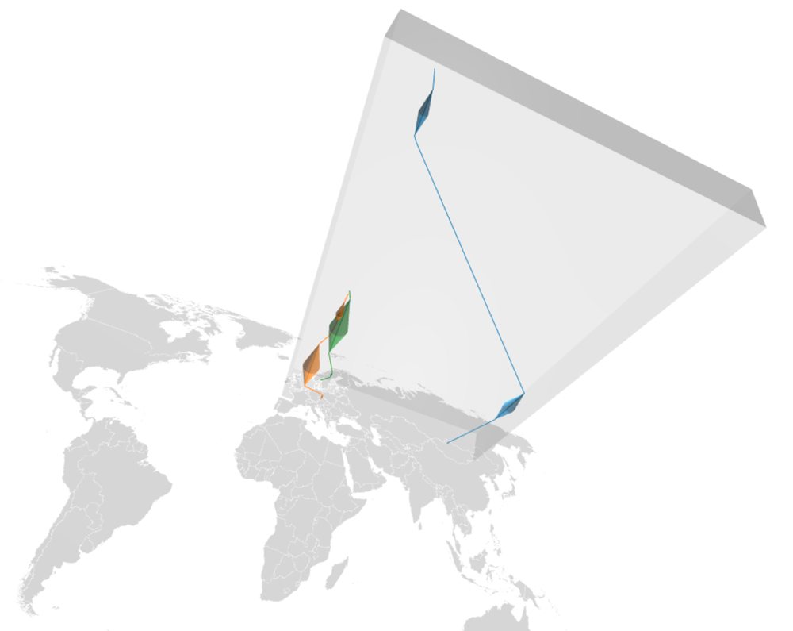

# GéoRécits3D: mapping journeys in space-time

Spatial mobility always involves at least two types of distances:

- the _topographical distance_ traveled on the surface of the Earth and
- the _time distance_ taken to do so.

GéoRécits3D allows you to map both in a space-time cuboid. 

## D3js and threejs

It is written using HTML5 and JavaScript, and uses the visualisation frameworks [D3js](https://github.com/d3/d3),version 5 and [threejs](https://github.com/mrdoob/three.js).

## Documentation

Configuration csv files for journeys identical to those of [GéoRécits](https://github.com/aourednik/georecits) can be used.

- [Full documentation HERE](https://ourednik.info/georecits3d/)

- [Running example HERE](https://ourednik.info/georecits3d/v01/)

